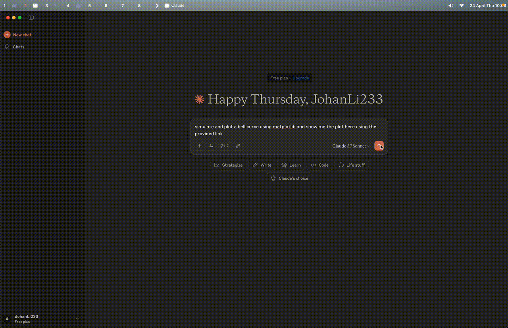

# MCP Sandbox

<p align="center">
  
</p>


# Feel free to try on [mcp sandbox](http://www.mcpsandbox.xyz/)

[](https://www.python.org/downloads/release/python-3120/)
[](https://opensource.org/licenses/Apache-2.0)
[](https://github.com/astral-sh/uv)
[](https://github.com/estitesc/mission-control-link)

[中文文档](README_zh.md) | English

# Demo 
<p align="center">
  
</p>

Python MCP Sandbox is an interactive Python code execution tool that allows users and LLMs to safely execute Python code and install packages in isolated Docker containers.

# Viby
[Viby](https://github.com/JohanLi233/viby) works with mcp sandbox

## Features

- 🐳 **Docker Isolation**: Securely run Python code in isolated Docker containers
- 📦 **Package Management**: Easily install and manage Python packages with support for custom PyPI mirrors
- 📊 **File Generation**: Support for generating files and accessing them via web links
- 🔐 **Authentication**: Optional API key-based authentication for multi-user environments
- 🎨 **Web UI**: Built-in web interface for managing sandboxes and viewing execution results
- 🌐 **SSE Support**: Real-time communication via Server-Sent Events for MCP integration

## Installation

```bash
# Clone the repository
git clone https://github.com/JohanLi233/python-mcp-sandbox.git
cd python-mcp-sandbox

# Install dependencies using uv
uv venv
uv sync

# Start the server
uv run main.py
```

The default SSE endpoint is http://127.0.0.1:8181/sse, and you can interact with it via the MCP Inspector through SSE or any other client that supports SSE connections.

## Configuration

The server configuration can be customized in [config.toml](config.toml):

- **Host**: Default is `127.0.0.1` (localhost only)
- **Port**: Default is `8181`
- **PyPI Mirror**: Configure your preferred Python package index mirror

To allow external access, change the host to `0.0.0.0` in the configuration file.

### Available Tools

1. **create_sandbox**: Creates a new Python Docker sandbox and returns its ID for subsequent code execution and package installation
2. **list_sandboxes**: Lists all existing sandboxes (Docker containers) for reuse
3. **execute_python_code**: Executes Python code in a specified Docker sandbox
4. **install_package_in_sandbox**: Installs Python packages in a specified Docker sandbox
5. **check_package_installation_status**: Checks if a package is installed or installation status in a Docker sandbox
6. **execute_terminal_command**: Executes a terminal command in the specified Docker sandbox. Parameters: `sandbox_id` (string), `command` (string). Returns `stdout`, `stderr`, `exit_code`.
7. **upload_file_to_sandbox**: Uploads a local file to the specified Docker sandbox. Parameters: `sandbox_id` (string), `local_file_path` (string), `dest_path` (string, optional, default: `/app/results`).

## Project Structure

```
python-mcp-sandbox/
├── main.py                    # Application entry point
├── requirements.txt           # Project dependencies
├── Dockerfile                 # Docker configuration for Python containers
├── results/                   # Directory for generated files
├── python_sandbox/               # Main package directory
│   ├── __init__.py
│   ├── models.py              # Pydantic models
│   ├── api/                   # API related components
│   │   ├── __init__.py
│   │   └── routes.py          # API route definitions
│   ├── core/                  # Core functionality
│   │   ├── __init__.py
│   │   ├── docker_manager.py  # Docker container management
│   │   └── mcp_tools.py       # MCP tools
│   └── utils/                 # Utilities
│       ├── __init__.py
│       ├── config.py          # Configuration constants
│       ├── file_manager.py    # File management
│       └── task_manager.py    # Periodic task management
└── README.md                  # Project documentation
```

## Example Prompt
```
I've configured a Python code execution sandbox for you. You can run Python code using the following steps:

1. First, use the "list_sandboxes" tool to view all existing sandboxes (Docker containers).
   - You can reuse an existing sandbox_id if a sandbox exists, do not create a new one.
   - If you need a new sandbox, use the "create_sandbox" tool.
   - Each sandbox is an isolated Python environment, and the sandbox_id is required for all subsequent operations.

2. If you need to install packages, use the "install_package_in_sandbox" tool
   - Parameters: sandbox_id and package_name (e.g., numpy, pandas)
   - This starts asynchronous installation and returns immediately with status

3. After installing packages, you can check their installation status using the "check_package_installation_status" tool
   - Parameters: sandbox_id and package_name (name of the package to check)
   - If the package is still installing, you need to check again using this tool

4. Use the "execute_python_code" tool to run your code
   - Parameters: sandbox_id and code (Python code)
   - Returns output, errors and links to any generated files
   - All generated files are stored inside the sandbox, and file_links are direct HTTP links for inline viewing

Example workflow:
- Use list_sandboxes to check for available sandboxes, if no available sandboxes, use create_sandbox to create a new one → Get sandbox_id
- Use install_package_in_sandbox to install necessary packages (like pandas, matplotlib), with the sandbox_id parameter
- Use check_package_installation_status to verify package installation, with the same sandbox_id parameter
- Use execute_python_code to run your code, with the sandbox_id parameter

Code execution happens in a secure sandbox. Generated files (images, CSVs, etc.) will be provided as direct HTTP links, which can viewed inline in the browser.

Remember not to use plt.show() in your Python code. For visualizations:
- Save figures to files using plt.savefig() instead of plt.show()
- For data, use methods like df.to_csv() or df.to_excel() to save as files
- All saved files will automatically appear as HTTP links in the results, which you can open or embed directly.
```

## MCP Example Config

Below is an example config for Claude Desktop:

```json
{
  "mcpServers": {
    "mcpSandbox": {
      "command": "npx",
      "args": ["-y", "supergateway", "--sse",  "http://127.0.0.1:8181/sse"]
    }
  }
}
```

If authentication is enabled, include the API key:

```json
{
  "mcpServers": {
    "mcpSandbox": {
      "command": "npx",
      "args": ["-y", "supergateway", "--sse",  "http://127.0.0.1:8181/sse?api_key=<YOUR_API_KEY>"]
    }
  }
}
```

## MCP Example Config for Online Demo
```json
{
  "mcpServers": {
    "mcpSandbox": {
      "command": "npx",
      "args": ["-y", "supergateway", "--sse",  "http://115.190.87.78/sse?api_key=<API_KEY>"]
    }
  }
}
```

Modify the `serverUrl` as needed for your environment.
